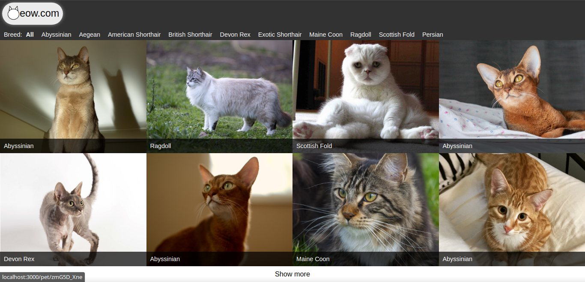
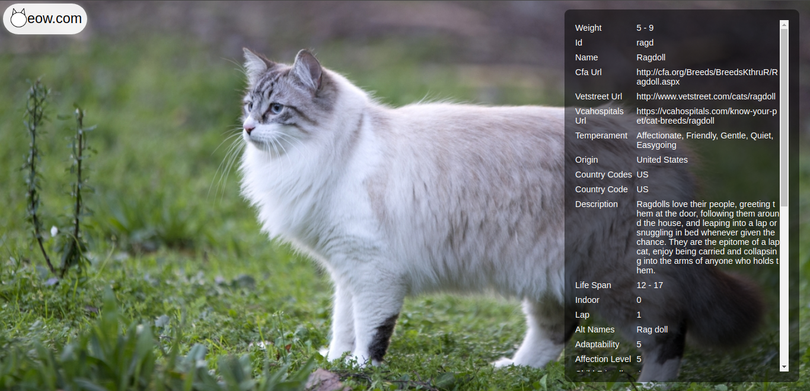
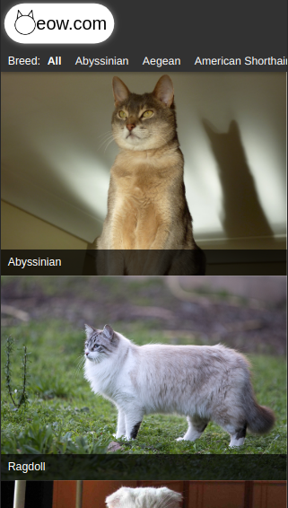
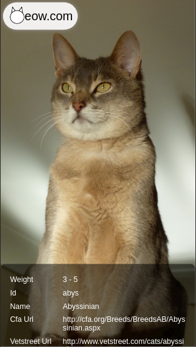

# Meow

Meow is an online Gallery for Cat lovers.\
It has the 10 most loved breeds of Cats, namely Abyssinian, Aegean, American Shorthair, British Shorthair, Devon Rex, Exotic Shorthair, Maine Coon, Ragdoll, Scottish Fold and Persian.\
Feel free to browse, view their photos and learn some interesting facts about them.

## Demo Link

https://krishnzzz.github.io/meow

## Screenshots

### Desktop:

### Mobile:

## Cloning

The following commands must be ran on terminal/CMD:
- In your desired directory, run `git clone https://github.com/krishnzzz/meow`.
- Then run `cd meow`.
- From the meow project directory the following scripts can be run.

## Available Scripts

In the project directory, you can run:

### `npm start`

Runs the app in the development mode.\
Open [http://localhost:3000](http://localhost:3000) to view it in the browser.

The page will reload if you make edits.\
You will also see any lint errors in the console.

### `npm test`

Launches the test runner in the interactive watch mode.\
See the section about [running tests](https://facebook.github.io/create-react-app/docs/running-tests) for more information.

## Built With

- HTML 
- SCSS
- Linter
- JS
- VScode
- React
- Router
- Redux

## Contributing

Contributions, issues and feature requests are welcome! Start by:

  - Forking the project
  - Cloning the project to your local machine
  - cd into the project directory
  - Run git checkout -b your-branch-name
  - Make your contributions
  - Push your branch up to your forked repository
  - Open a Pull Request with a detailed description to the development branch of the original project for a review

## Author

👤 Suyash Fowdar
- Github: [@Krishnzzz](https://github.com/krishnzzz)
- Twitter: [@twitterhandle](https://twitter.com/Krishnzzz)
- LinkedIn: [LinkedIn](https://www.linkedin.com/in/suyash-fowdar-22b89514a/)

## Show your Support
Give a ⭐ if you like this project!
